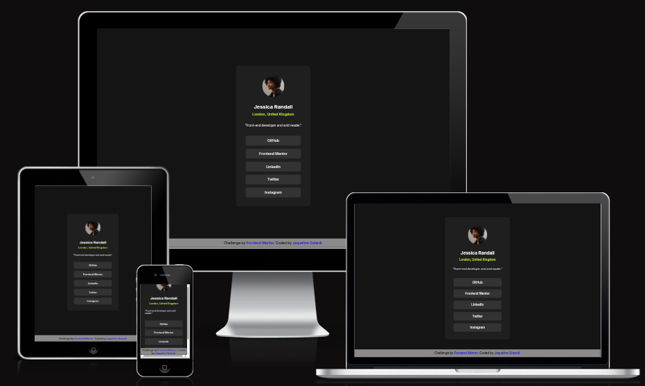

# 🔗 Social Links Profile  

Projeto desenvolvido como parte de um **desafio do Frontend Mentor**.  
A proposta era recriar o design fornecido em imagem, praticando **HTML5, CSS3 e responsividade**, e o resultado foi implementado por mim do zero.  

---

## 🖼️ Prévia da Página
 

---

## 🎯 Objetivos do Projeto
- Reforçar o uso de **HTML semântico**;
- Trabalhar com **CSS puro** para estilização;
- Praticar **responsividade em telas pequenas**;
- Criar um **layout moderno e minimalista** inspirado no design original do desafio;

---

## 🛠️ Tecnologias Utilizadas
- **HTML5**; 
- **CSS3**;
- **Google Fonts**;

---

## 📱 Responsividade
A página foi desenvolvida para se adaptar bem em diferentes dispositivos:  
- 🖥️ **Desktop**;
- 💻 **Tablets**;
- 📱 **Smartphones**;

---

## 💡 Aprendizados
Durante esse projeto, aprimorei:  
- Estruturação de código **clara e organizada**; 
- Uso de **Flexbox** para alinhar elementos;
- Criação de **estados de hover interativos** em links;
- Implementação de um **footer fixo e responsivo**;

---

## 📌 Próximos Passos
- Implementar **animações suaves** nas interações;
- Explorar uma versão **dark/light theme**;
- Melhorar a **acessibilidade** (atributos ARIA e contraste);

---

## ✨ Autor
Desenvolvido por **Jaqueline Gotardi**💻🩵
> 🔖 Desafio proposto por [Frontend Mentor](https://www.frontendmentor.io), código e implementação por mim 🩵
